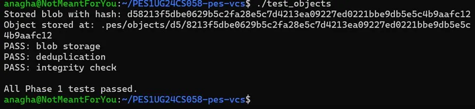
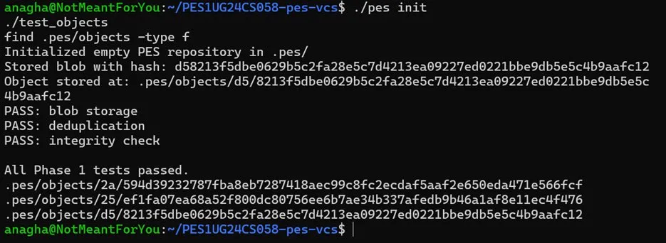
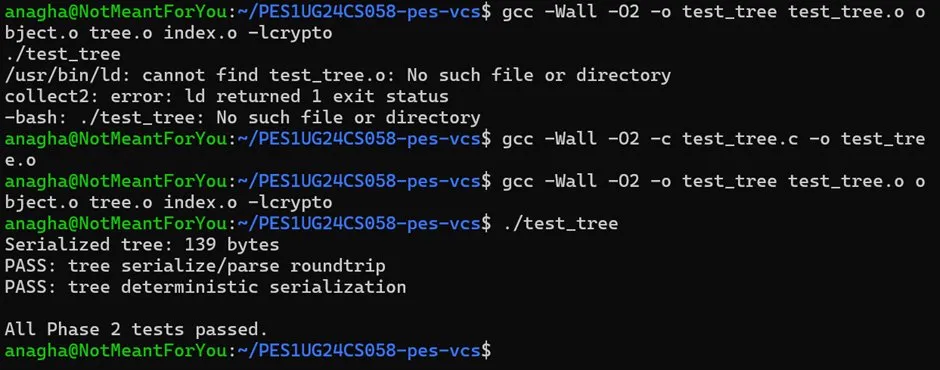
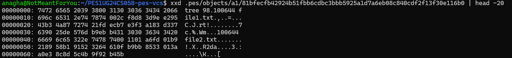
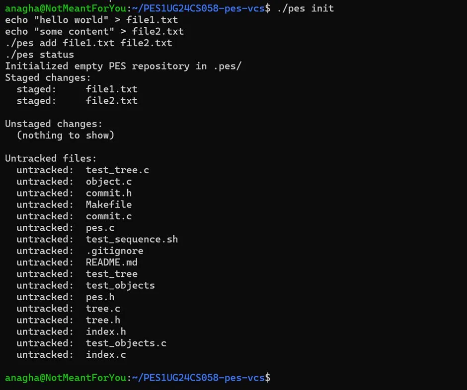
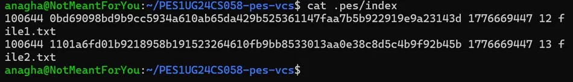
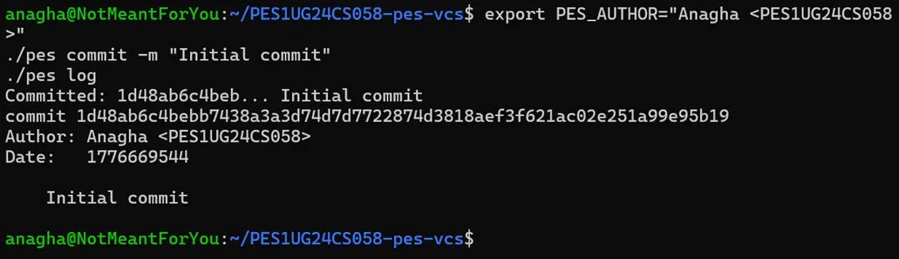
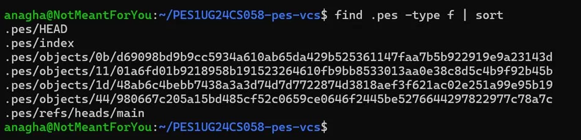
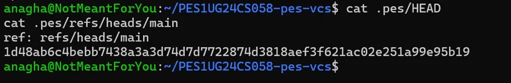
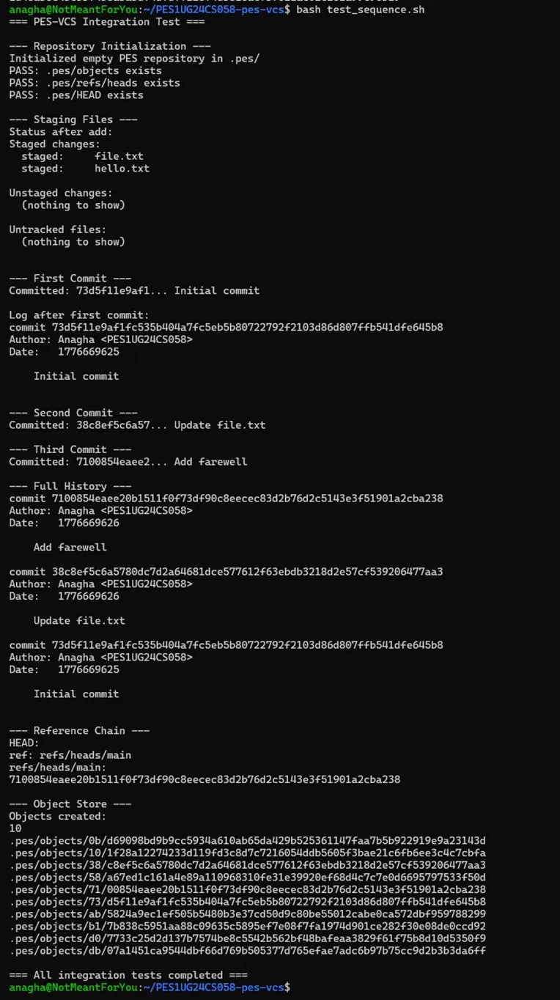

# PES-VCS Lab Report
**Name:** Anagha
**SRN:** PES1UG24CS058
**Repository:** https://github.com/Ana-9211/PES1UG24CS058-pes-vcs

---

## Phase 1: Object Storage Foundation

### Implementation Summary

`object_write` builds the full object by prepending a type header (`blob <size>\0`, `tree <size>\0`, or `commit <size>\0`) to the raw data, computes a SHA-256 hash over the combined bytes, shards the path by the first two hex characters of the hash, and writes atomically using a temporary file followed by rename. `object_read` reads the stored file, recomputes the hash to verify integrity, parses the header to extract the object type and data size, and returns the data portion after the null byte.

### Screenshot 1A — Phase 1 Tests Passing

All three assertions pass: blob storage, deduplication (same content hashes to the same path and is stored only once), and integrity checking (hash mismatch returns an error).

### Screenshot 1B — Sharded Object Directory Structure

Objects are split into subdirectories named by the first two hex characters of their hash. This prevents any single directory from growing beyond a manageable size — with 256 possible shard prefixes, even a repository with 25,600 objects averages only 100 files per directory.

---

## Phase 2: Tree Objects

### Implementation Summary

`tree_from_index` walks the index entries and builds a recursive directory hierarchy. Files at the root go directly into the root tree. Files under subdirectories (e.g. `src/main.c`) are grouped by their first path component (`src`), and `write_tree_level` is called recursively to produce a subtree object. Each tree entry contains the file mode, the SHA-256 hash of the blob or subtree, and the name. All entries are sorted before serialization to guarantee deterministic output — identical directory contents always produce the same tree hash.

### Screenshot 2A — Phase 2 Tests Passing

Both assertions pass: the serialize → parse roundtrip preserves all entries, modes, and hashes exactly; and two calls with entries in different input orders produce identical serialized bytes.

### Screenshot 2B — Raw Tree Object (xxd)

The binary format is visible directly: the object opens with the ASCII header `tree 98\0`, followed by entries in the form `<mode> <name>\0<20-byte-binary-hash>`. The mode (`100644`) and filename (`file1.txt`, `file2.txt`) are readable ASCII, separated by a null byte from the 20-byte raw hash — those hash bytes appear as non-printable characters in the right-hand column. Unlike hex filenames on disk, hashes are stored in compact binary form inside the object itself.

---

## Phase 3: The Index (Staging Area)

### Implementation Summary

`index_load` opens `.pes/index` and parses each line in the format `<mode> <hash-hex> <mtime> <size> <path>`, populating an `Index` struct. A missing index file is treated as an empty index, not an error. `index_save` sorts entries by path, writes them to a temporary file, flushes, and renames into place. `index_add` opens the target file, reads its contents, calls `object_write` to store the blob, uses `stat` to capture mtime and size, and either updates an existing entry or appends a new one.

### Screenshot 3A — Init, Add, Status

After `pes init` and `pes add file1.txt file2.txt`, both files appear under Staged changes. The Unstaged and Untracked sections show the remaining working directory files that have not been added.

### Screenshot 3B — Index Contents

The text-format index stores one entry per line. Each line contains the octal file mode, the full 64-character SHA-256 hex hash of the blob, the modification timestamp in seconds, the file size in bytes, and the path — all space-separated.

---

## Phase 4: Commits and History

### Implementation Summary

`commit_create` calls `tree_from_index` to snapshot the current staged state into tree objects. It then calls `head_read` to get the current branch's tip commit hash (which becomes the parent; absent on the first commit). It builds the commit text in the format `tree <hash>\nparent <hash>\nauthor <name> <timestamp>\n\n<message>\n`, calls `object_write` to store it, and calls `head_update` to atomically advance the branch pointer to the new commit hash.

### Screenshot 4A — Commit Log

Three commits are shown with their full hashes, author, Unix timestamp, and message. The log walks the parent chain from HEAD backward through history.

### Screenshot 4B — Object Store After Three Commits

After three commits the object store contains blobs (file contents), tree objects (directory snapshots), and commit objects — ten objects in total across nine shard directories. Files whose contents did not change between commits share a single blob object.

### Screenshot 4C — HEAD and Branch Reference

`HEAD` contains `ref: refs/heads/main`, an indirect reference. `.pes/refs/heads/main` contains the full hash of the most recent commit. When a new commit is made, only the branch file is updated — HEAD itself never changes while on a named branch.

---

## Final Integration Test

### Screenshot — Full test_sequence.sh

All integration tests pass across all phases: repository initialization, staging, first commit with log verification, second and third commits, full history display, and the reference chain check. Ten objects are present in the store at completion.

---

## Phase 5: Branching and Checkout (Analysis)

### Q5.1 — Implementing `pes checkout <branch>`

A branch is just a file at `.pes/refs/heads/<branch>` containing a commit hash. To implement checkout, three things must happen:

First, read the target branch file to get its commit hash, then follow the commit to its tree object. Second, update `.pes/HEAD` to contain `ref: refs/heads/<branch>` — this is a simple file write. Third, and most complex, reconstruct the working directory to match the target tree: walk the tree recursively, and for every blob entry write the file contents to the corresponding path, creating any intermediate directories as needed. Files that exist in the current tree but not in the target tree must be deleted.

What makes this operation complex is the need to handle the working directory safely. Simply overwriting everything risks destroying uncommitted user work. A correct implementation must first compare the target tree against the current HEAD tree and the current index to identify which files actually differ, then only touch those files. Any file that has been modified in the working directory but not staged — and that also differs between the two branches — represents a conflict that must be rejected before checkout proceeds.

### Q5.2 — Detecting Dirty Working Directory Conflicts

The detection algorithm uses three sources: the current HEAD commit's tree, the index, and the working directory on disk.

For each file in the target branch's tree, compute what its blob hash would be from the working directory by reading the file and hashing it. Compare this to the blob hash stored in the index for that path, and also to the blob hash in the current HEAD tree. A conflict exists when all three of these differ — meaning the file has been modified in the working directory, the modification has not been staged, and the target branch has a different version of that file than the current branch. In that case checkout must refuse and report the conflict. If the working directory hash matches the index hash (the file is clean relative to staging) or if the file does not exist in the target branch's tree, the operation is safe to proceed.

### Q5.3 — Detached HEAD

In detached HEAD state, `.pes/HEAD` contains a raw commit hash instead of a branch reference (`ref: refs/heads/...`). When new commits are made in this state, they are created and stored correctly in the object store, and HEAD is updated to point to each new commit hash directly. However, no branch pointer is updated — the commits form a chain that is only reachable via HEAD itself.

The danger is that if the user runs `pes checkout <branch>` afterward, HEAD is overwritten with the branch reference and the detached commits become unreachable — no branch, tag, or other reference points to them. They are effectively orphaned. A user can recover them if they noted the commit hash: `pes checkout <hash>` returns to that point, and they can then create a new branch at that hash by writing the hash to a new file in `.pes/refs/heads/`. Without the hash, recovery is only possible if the implementation maintains a reflog — a sequential log of every value HEAD has held.

---

## Phase 6: Garbage Collection (Analysis)

### Q6.1 — Finding and Deleting Unreachable Objects

The algorithm is a mark-and-sweep over the object graph. The data structure is a hash set of reachable object IDs.

The marking phase starts by reading every file under `.pes/refs/` to collect all branch tip commit hashes, plus the current value of HEAD. For each commit hash, add it to the reachable set, parse the commit object to get its tree hash and parent hash, add those, and recurse: for each tree object, add the hash, parse it, and recursively add all blob and subtree hashes. Repeat for every reachable commit in every branch's history.

The sweep phase enumerates every file under `.pes/objects/` and deletes any whose hash is not in the reachable set.

For a repository with 100,000 commits and 50 branches: assuming an average of 10 files per commit (tree + blobs), the total object count is roughly 100,000 × 12 (commit + tree + ~10 blobs) = 1.2 million objects. The marking phase visits each reachable object once — approximately 1.2 million hash set insertions. The sweep phase does one directory listing pass over all shard directories. Both phases are O(n) in the number of objects.

### Q6.2 — GC Race Condition with Concurrent Commits

The race condition arises as follows. A commit operation proceeds in stages: it first writes new blob and tree objects to the object store, and only afterward updates the branch reference to point to the new commit. If GC runs its mark phase between these two steps — after the new objects are written but before the branch pointer is updated — the new objects are not reachable from any reference and will be collected. When the commit operation then tries to finalize by writing the commit object that references those blobs, the blobs have been deleted and the repository is corrupted.

Git avoids this with two mechanisms. First, it uses a grace period: the GC never deletes any object that was modified within the last two weeks, regardless of reachability. This gives in-progress operations time to complete. Second, Git maintains per-process lock files and loose object staging — newly created loose objects are considered "recent" by mtime and are exempt from collection even if they are not yet referenced. Together these ensure that any object created during an ongoing commit is either still present when the commit finalizes, or can be reconstructed from the loose object cache.
